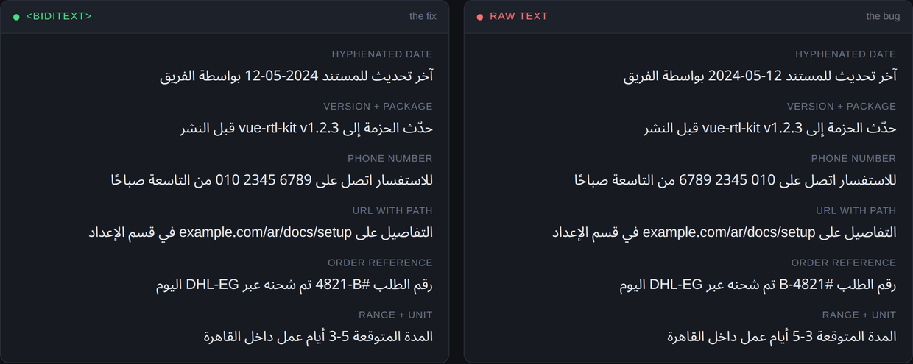
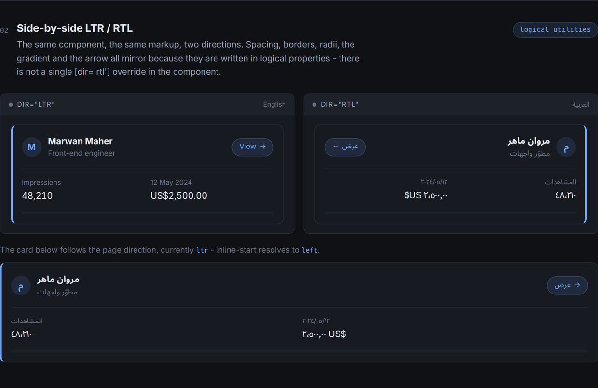
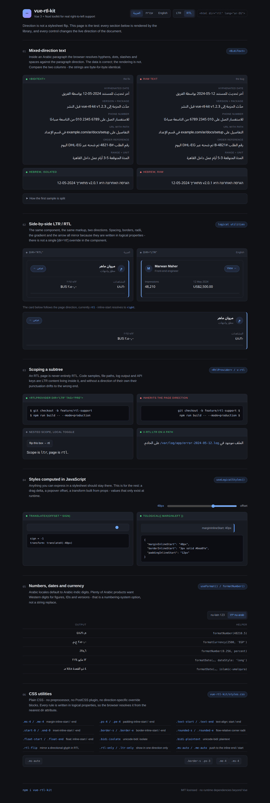

# vue-rtl-kit

[](https://github.com/MarwanMaher0/vue-rtl-kit/actions/workflows/ci.yml)
[](https://www.npmjs.com/package/vue-rtl-kit)
[](./LICENSE)
[](./src/types.ts)

Right-to-left support for Vue 3 and Nuxt — direction state that survives SSR, logical-property
utilities, and Unicode-isolated bidirectional text.

Most "RTL support" is a stylesheet flip. That covers layout and stops at the hard part: what the
browser does to your *text*.

---

## The bug this library exists for

Put a date, a version number, a phone number or a URL inside an Arabic sentence and the browser
renders it in the wrong order.

```
Data:      آخر تحديث للمستند 12-05-2024 بواسطة الفريق
Rendered:  آخر تحديث للمستند 2024-05-12 بواسطة الفريق
                             ^^^^^^^^^^ the day and the year have swapped
```

Nothing is wrong with the string. The Unicode Bidirectional Algorithm resolves *neutral*
characters — hyphens, dots, slashes, colons, spaces — against the direction of the surrounding
paragraph, so a Latin run sitting inside Arabic text gets reordered on the way to the screen.

That is why this one ships. The value in the database is right, the value in the API response is
right, the value in your unit test is right. Only the pixels are wrong, and only for readers of
the RTL locale.



Left panel, `<BidiText>`. Right panel, raw text. The strings are byte-for-byte identical:

| Data | Rendered raw | With `<BidiText>` |
| --- | --- | --- |
| `12-05-2024` | `2024-05-12` | `12-05-2024` |
| `010 2345 6789` | `6789 2345 010` | `010 2345 6789` |
| `#4821-B` | `B-4821#` | `#4821-B` |
| `3-5 أيام` | `5-3 أيام` | `3-5 أيام` |

The fix is an *isolate* — `U+2066 LRI` … `U+2069 PDI`, or its DOM equivalent `<bdi>` — which tells
the algorithm to resolve the run on its own terms and treat the result as a single neutral
character in the outer paragraph.

```vue
<!-- broken -->
<p>{{ message }}</p>

<!-- correct -->
<BidiText as="p" :text="message" />
```

`<BidiText>` does not wrap the whole string. It splits the text into directional runs and isolates
only the ones that would actually move, so a trailing comma stays with the Arabic sentence and a
bare `2024` — which reads the same either way — is left alone.

---

## Install

```sh
npm install vue-rtl-kit
```

Vue 3.3+. No runtime dependencies. For Nuxt, `@nuxt/kit` is an optional peer you already have.

## Quickstart — Vue

```ts
// main.ts
import { createApp } from 'vue'
import { createRtl } from 'vue-rtl-kit'
import 'vue-rtl-kit/styles.css' // optional: the logical-property utilities
import App from './App.vue'

const rtl = createRtl({
  locales: { en: 'ltr', ar: 'rtl', he: 'rtl' },
  defaultLocale: 'ar',
})

createApp(App).use(rtl).mount('#app')
```

`createRtl` keeps `<html dir>` and `<html lang>` in sync, and registers `<BidiText>`,
`<RtlProvider>` and `v-rtl` globally.

```vue
<script setup lang="ts">
import { useDirection } from 'vue-rtl-kit'

const { dir, isRtl, setLocale, toggleDirection } = useDirection()
</script>

<template>
  <button @click="toggleDirection">{{ isRtl ? 'English' : 'العربية' }}</button>
  <BidiText as="p" :text="`آخر تحديث ${updatedAt}`" />
  <pre v-rtl:ltr><code>npm install vue-rtl-kit</code></pre>
</template>
```

## Quickstart — Nuxt

```ts
// nuxt.config.ts
export default defineNuxtConfig({
  modules: ['vue-rtl-kit/nuxt'],
  rtl: {
    locales: { en: 'ltr', ar: 'rtl' },
    defaultLocale: 'ar',
  },
})
```

The module registers the plugin, auto-imports the composables, injects the stylesheet, and writes
`dir` and `lang` onto `<html>` **during SSR** — so the server-rendered HTML is already in the right
direction and there is no flash of LTR before hydration.

| Module option | Default | Notes |
| --- | --- | --- |
| everything from `RtlOptions` | — | see the table below |
| `autoImports` | `true` | auto-import `useDirection`, `useRtl`, `useLogicalStyles`, `useFormat` |
| `components` | `true` | register `<RtlProvider>` and `<BidiText>` globally |
| `css` | `true` | inject `vue-rtl-kit/styles.css` |

---

## API

### `createRtl(options)`

| Option | Type | Default | Description |
| --- | --- | --- | --- |
| `locales` | `string[] \| Record<string, Direction>` | `{}` | Supported locales. A list infers direction from the tag; a map states it. |
| `defaultLocale` | `string` | first locale, else `'en'` | Initial locale. |
| `dir` | `'rtl' \| 'ltr'` | inferred from `defaultLocale` | Pin the initial direction, overriding the locale. |
| `syncDocument` | `boolean` | `true` | Keep `<html dir>` / `<html lang>` in sync. No-op on the server. |
| `htmlClass` | `boolean \| { rtl, ltr }` | `false` | Also toggle `rtl` / `ltr` class names on `<html>`. |
| `numberingSystem` | `NumberingSystem \| Record<string, NumberingSystem>` | — | Default digits for the formatters — `'latn'`, `'arab'`, … |
| `registerGlobals` | `boolean` | `true` | Register the components and the directive globally. |

Returns an `RtlInstance`: a Vue plugin *and* a store you can drive from outside the component tree
(a router guard, a settings action, an SSR shell).

### Composables

| Export | Returns | Description |
| --- | --- | --- |
| `useDirection()` | `DirectionContext` | `dir`, `isRtl`, `isLtr`, `locale`, `startSide`, `endSide`, `sign`, `setDirection()`, `toggleDirection()`, `setLocale()`, `htmlAttrs()`. Resolves to the nearest `<RtlProvider>`, then the app store, then a detached fallback — it never throws. |
| `useRtl()` | `RtlInstance` | The app-level store, skipping any `<RtlProvider>`. Throws if the plugin is missing. |
| `useLogicalStyles()` | see below | `toLogical()`, `toPhysical()`, `property()`, `mirror()`, plus `startSide`, `endSide`, `sign`. |
| `useFormat()` | `ComputedRef<BoundFormatters>` | `formatNumber` / `formatCurrency` / `formatDate` bound to the current locale and numbering system. |

### Components

| Component | Props | Description |
| --- | --- | --- |
| `<BidiText>` | `text`, `as` (`'span'`), `dir` (`'rtl' \| 'ltr' \| 'auto'`), `strategy` (`'element' \| 'chars'`), `enabled` (`true`) | Isolates mixed-direction runs. `strategy="element"` emits `<bdi>`; `strategy="chars"` emits `U+2066`/`U+2067` … `U+2069`. `:enabled="false"` renders raw text, for A/B-ing the fix. |
| `<RtlProvider>` | `dir`, `locale`, `tag` (`'div'`, `null` for renderless), `isolate` (`true`) | Scopes a subtree to its own direction. Slot props: `{ dir, isRtl, setDirection, toggleDirection }`. |

### Directive

```vue
<pre v-rtl:ltr>…</pre>              <!-- dir="ltr" -->
<span v-rtl.ltr.isolate>…</span>    <!-- dir="ltr" + unicode-bidi: isolate -->
<div v-rtl="userDir">…</div>        <!-- reactive -->
<div v-rtl="{ dir: 'ltr', isolate: true }">…</div>
```

`v-rtl` with no value means `dir="rtl"`. It restores the element's previous `dir` on unbind, so it
is safe on server-rendered markup that already carried one, and it implements `getSSRProps`, so the
attribute is present in the server-rendered HTML too.

### Bidi utilities

| Function | Description |
| --- | --- |
| `isolate(text, dir?)` | Wrap a whole string in one isolate. `'auto'` (default) emits FSI. |
| `isolateRuns(text, baseDir)` | The string form of `<BidiText>`, for `title`, `aria-label`, `<canvas>`, toasts — anywhere elements cannot go. |
| `splitBidiRuns(text, baseDir)` | The raw runs: `{ text, dir, isolated, hasStrong }[]`. |
| `detectDirection(text, fallback?)` | First-strong-character detection, the same rule as `dir="auto"`. |
| `isMixedDirection(text)` / `hasRtlCharacters(text)` | Cheap predicates. |
| `stripBidiControls(text)` | Remove every bidi control character. |
| `classifyChar(char)` | `'L' \| 'R' \| 'EN' \| 'AN' \| 'N'`. |
| `LRI`, `RLI`, `FSI`, `PDI`, `LRM`, `RLM` | The control characters, named. |

### Logical-property helpers

CSS logical properties solve direction in the stylesheet. These are for the values that only exist
at runtime — a drag delta, a popover offset, a transform built from props.

```ts
import { toLogicalStyle, toPhysicalStyle } from 'vue-rtl-kit'

toLogicalStyle({ marginLeft: '8px', textAlign: 'left' })
// { marginInlineStart: '8px', textAlign: 'start' }

toPhysicalStyle({ marginInlineStart: '8px' }, 'rtl')
// { marginRight: '8px' }   ← for <canvas>, SVG, PDF and email templates
```

| Function | Description |
| --- | --- |
| `toLogicalStyle(style, options?)` | Physical → logical. `{ size: true }` also maps `width`/`height`; `{ values: false }` leaves `textAlign: 'left'` alone. |
| `toPhysicalStyle(style, dir)` | Logical → physical, for environments without logical-property support. |
| `logicalProperty(name, options?)` | One property name, either casing preserved. |

Covers margin, padding, border (width/style/colour), corner radii, inset, scroll margin/padding,
overflow, and the directional *values* of `text-align`, `float`, `clear`, `caption-side`, `resize`.

### Formatting

```ts
import { formatCurrency, formatDate, formatNumber } from 'vue-rtl-kit'

formatNumber(1234.5, { locale: 'ar-EG' })                            // '١٬٢٣٤٫٥'
formatNumber(1234.5, { locale: 'ar-EG', numberingSystem: 'latn' })   // '1,234.5'
formatCurrency(2500, 'EGP', { locale: 'ar-EG' })
formatDate(date, { locale: 'ar-SA', calendar: 'islamic-umalqura', dateStyle: 'long' })
```

Thin wrappers over `Intl` that add two things RTL products keep needing: an explicit numbering
system (Arabic locales default to Arabic-Indic digits — plenty of Arabic products want Western
digits for figures, IDs and versions), and `isolate: true` to wrap the result before it is spliced
into a sentence. `transliterateDigits(text, 'arab' | 'latn' | 'arabext')` converts digits in text
you did not format yourself.

### Locale helpers

`directionOfLocale(tag, fallback?)` resolves a BCP-47 tag to a direction. The script subtag wins
when present, so `az-Arab` is RTL and `ku-Latn` is LTR. Also exported: `resolveDirection`,
`normaliseLocales`, `oppositeDirection`, `RTL_LANGUAGES`.

---

## CSS utilities

`import 'vue-rtl-kit/styles.css'` — plain CSS. No preprocessor, no PostCSS plugin, no build step,
and no `[dir="rtl"]` override blocks: every rule is written in logical properties, so the browser
resolves it from the nearest `dir` attribute and a runtime direction flip needs no stylesheet swap.

| Class | Property |
| --- | --- |
| `.ms-{0,1,2,3,4,5,6,8,10,12,auto}` | `margin-inline-start` |
| `.me-{…}` | `margin-inline-end` |
| `.mi-{0,1,2,3,4,auto}` | `margin-inline` |
| `.ps-{…}` / `.pe-{…}` | `padding-inline-start` / `-end` |
| `.pi-{0,1,2,3,4,6}` | `padding-inline` |
| `.text-start` / `.text-end` / `.text-center` | `text-align` |
| `.float-start` / `.float-end` | `float: inline-start / -end` |
| `.clear-start` / `.clear-end` | `clear` |
| `.justify-start` / `.justify-end` / `.items-start` / `.items-end` | flexbox alignment |
| `.start-0` / `.end-0` / `.start-auto` / `.end-auto` / `.inset-i-0` | `inset-inline-start` / `-end` |
| `.border-s` / `.border-e` / `.border-s-0` / `.border-e-0` | `border-inline-start` / `-end` |
| `.rounded-s` / `.rounded-e` / `.rounded-s-0` / `.rounded-e-0` | flow-relative corner radii |
| `.bidi-isolate` / `.bidi-plaintext` / `.bidi-nowrap` | `unicode-bidi` |
| `.rtl-flip` / `.rtl-noflip` | mirror a directional glyph in RTL (arrows, chevrons — never logos or checkmarks) |
| `.rtl-only` / `.ltr-only` | show in one direction only |
| `.nums-latn` | lining figures, isolated |

One component, one set of markup, both directions — no `[dir="rtl"]` override block anywhere in it:



The spacing scale is multiples of `--rtl-space` (default `0.25rem`). Override it once on `:root` to
match an existing design system:

```css
:root { --rtl-space: 0.5rem; }
```

---

## SSR

- Nothing in the library touches `document` at import time or during render. `createRtl()` is safe
  to call on the server; the document-sync watcher is skipped when there is no DOM.
- `rtl.htmlAttrs()` returns `{ dir, lang }` for your SSR shell. The Nuxt module feeds it to
  `useHead()` for you.
- `<BidiText>` and `<RtlProvider>` render their isolates into the server HTML, so the markup
  hydrates without a mismatch and without a frame of wrongly ordered text.
- `v-rtl` implements `getSSRProps`, so `dir` is in the server output too.
- The test suite includes a Node-environment file (no `window`, no `document`) that renders every
  component through `vue/server-renderer`.

## Browser support

Everything is native platform behaviour, no polyfills:

| Feature | Chrome | Firefox | Safari |
| --- | --- | --- | --- |
| `<bdi>` and Unicode isolates | 16 | 10 | 6.1 |
| CSS logical properties (margin/padding/inset/border) | 87 | 66 | 14.1 |
| Flow-relative corner radii (`border-start-start-radius`) | 89 | 66 | 15 |
| `Intl` numbering systems (`-u-nu-`) | 24 | 29 | 10 |

`toPhysicalStyle()` is the escape hatch for anywhere logical properties do not reach — `<canvas>`,
inline SVG, PDF renderers, email templates.

## Playground

```sh
npm install
npm run play      # http://localhost:5178
```

Every feature, including the before/after comparison above and a live LTR/RTL toggle that changes
the real document direction.



## Development

```sh
npm run test        # vitest, 106 tests
npm run typecheck   # vue-tsc --noEmit
npm run lint        # eslint
npm run build       # ESM + CJS + d.ts + styles.css
```

## Licence

[MIT](./LICENSE) © Marwan Maher
